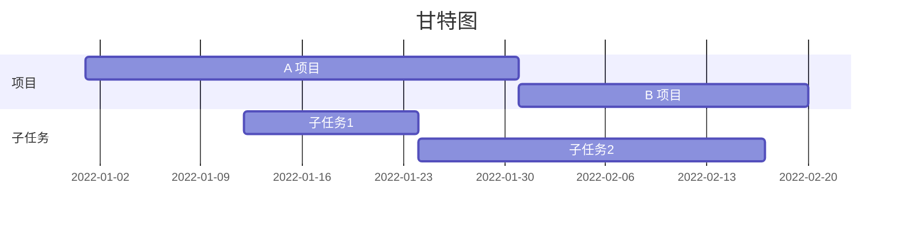

# SNAwR_Final_Project
Final Project implementation for SNAwR MASNA 2022
**Contributors**: @gabriellexd @xx  
**Project Description**: 
 [Project Description by stanislav](https://github.com/gabriellexd/SNAwR_Final_Project/blob/main/Project%20Description_2022__ver1.pdf
) 
**Deadlines**: 
- Large Presentation: Dec-24 
- Small Presentation: Dec-30
## **1. Implementation timeline**

## **2. Meeting Minutes**
|| Date | Goal | Agenda | Next Steps| Others |
|--| -- | -- | :-- | :-- | -- |
|1|Nov.18(TBD)|Kick-Off meeting|- 10 min Project briefing  -...  -  |...|link/any comment
 |

## **3. Study Material**
## **4. Reference**